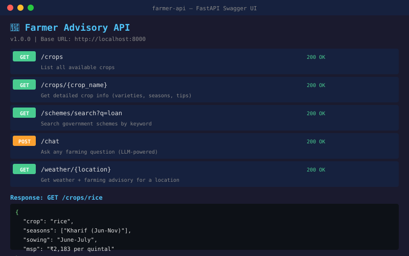

# 🌾 Farmer Advisory API



Production REST API for the Farmer Advisory Agent. Built with FastAPI.

**This is the backend** — the Streamlit app is the demo layer. Real products need APIs.

---

## 🚀 Quick Start

```bash
pip install -r requirements.txt
uvicorn api.main:app --reload
```

Open http://localhost:8000/docs for Swagger UI (auto-generated API docs).

---

## 📡 Endpoints

| Method | Endpoint | Description |
|--------|----------|-------------|
| GET | `/crops` | List all crops |
| GET | `/crops/{name}` | Get crop details (rice, wheat, cotton...) |
| GET | `/schemes` | List all schemes |
| GET | `/schemes/{key}` | Get scheme details (pm_kisan, ayushman...) |
| GET | `/schemes/search?q=loan` | Search schemes by keyword |
| GET | `/weather/{location}` | Get weather + farming advisory |
| POST | `/chat` | Ask any farming question (requires API key) |
| GET | `/docs` | Swagger UI |
| GET | `/redoc` | ReDoc |
| GET | `/openapi.json` | OpenAPI schema |

---

## 🧪 Tests

```bash
pip install httpx
python tests/test_api.py
```

12 tests covering all endpoints, error handling, and schema validation.

---

## 🧠 Learn & Extend

### Level 1: Understand FastAPI
- Read `api/main.py` — see how routes, models, and responses work
- Open `/docs` — try the interactive Swagger UI
- Run tests — see how TestClient works

### Level 2: Add features
- **TODO:** Add API key authentication (FastAPI security)
- **TODO:** Add rate limiting (slowapi)
- **TODO:** Add response caching (Redis)
- **TODO:** Add request logging

### Level 3: Production
- **TODO:** Add Dockerfile
- **TODO:** Deploy to Railway/Fly.io
- **TODO:** Add monitoring (Prometheus metrics)
- **TODO:** Add database (PostgreSQL) for analytics

---

## 🤖 AI-Assisted Development

Scaffolded with AI, extended with domain expertise. See [BUILDING.md](BUILDING.md) in the parent farmer-advisory-agent repo.
